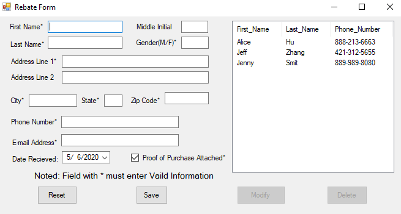

# Rebate-Form
# C#

# Data save in csv formate
# Feature
a.	Add a new record to the end of the file.
b.	Modify an existing record and write it back to the file.  This means that you can modify all fields of the record, including the name, but not the three invisible fields.
c.	Delete a record from the file.

